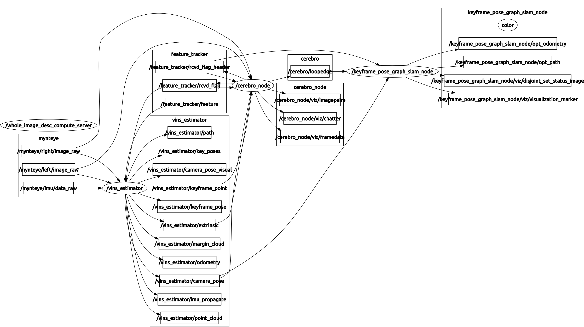

# VINS-Fusion with Cerebro
This is the cerebro module for VINS-Fusion. The aim of this project
is better loop detection and recover from kidnap. The cerebro node connects to
the vins_estimator nodes of VINS-Fusion
(with ros interface). The DataManager class handles
all the incoming data. Visualization handles all the visualization.
Cerebro class handles the loop closure intelligence part. It publishes a LoopMsg
which contains timestamps of the identified loopcandidate along with the
computed relative pose between the pair. The pose computation needs a stereo pair
for reliable pose computation.
This is a multi-threaded object oriented implementation and I observe a CPU load factor
of about 2.0. A separate node handles pose graph solver (it is in [github-repo](https://github.com/mpkuse/solve_keyframe_pose_graph) ).

If you use this work in your research, please cite: 
Manohar Kuse and Shaojie Shen, *“Learning Whole-Image Descriptors for Real-time Loop Detection and Kidnap Recovery under Large Viewpoint Difference“*, https://arxiv.org/abs/1904.06962

## Highlight Video
[](http://www.youtube.com/watch?v=lDzDHZkInos "Video Title")


## MyntEye Demo (Using VINS-Fusion as Odometry Estimator)
[](http://www.youtube.com/watch?v=3YQF4_v7AEg "Video Title")


[](http://www.youtube.com/watch?v=sTd_rZdW4DQ "Video Title")


## In Plane Rotation Test
[](http://www.youtube.com/watch?v=8bsRCNF2rnA "Video Title")


## MyntEye Demo (Using VINS-Mono as Odometry Estimator)
[](http://www.youtube.com/watch?v=KDRo9LpL6Hs "Video Title")

[](http://www.youtube.com/watch?v=XvoCrLFq99I "Video Title")


## EuRoC MAV Dataset live merge MH-01, ... MH-05.
[](http://www.youtube.com/watch?v=mnnoAlAIsN8 "Video Title")


## EuRoC MAV Dataset live merge V1_01, V1_02, V1_03, V2_01, V2_02

[](http://www.youtube.com/watch?v=rIaANkd74cQ "Video Title")


For more demonstration, have a look at my [youtube playlist](https://www.youtube.com/playlist?list=PLWyydx20vdPzs5VVhZu0TGsReT7U17Fxp)


## Visual-Inertial Datasets
- [ETHZ EuroC Dataset](https://projects.asl.ethz.ch/datasets/doku.php?id=kmavvisualinertialdatasets)
- [TUM Visual Inertial Dataset](https://vision.in.tum.de/data/datasets/visual-inertial-dataset)
- UPenn - [Penncosyvio](https://github.com/daniilidis-group/penncosyvio)
- [ADVIO](https://github.com/AaltoVision/ADVIO) ARKIT, Tango logging.
- Our MyntEye (Stereo+IMU) [One-drive-link](https://hkustconnect-my.sharepoint.com/:f:/g/personal/mpkuse_connect_ust_hk/EkTisuLkXLFBs_WHYkxoH2oBeVIkdLc3-5a_t1J9c_4wkg?e=h9cifx)

## How to run - Docker
I highly recommend the already deployed packages with docker.
Run the roscore on your host pc and all the packages run inside
of docker container. rviz runs on the host pc.

I assume you have a PC with a graphics card and cuda9 working smoothly
and nvidia-docker installed.
```
$(host) export ROS_HOSTNAME=`hostname`
$(host) roscore
# assume that host has the ip address 172.17.0.1 in docker-network aka docker0
$(host) docker run --runtime=nvidia -it --rm \
        --add-host `hostname`:172.17.0.1 \
        --env ROS_MASTER_URI=http://`hostname`:11311/ \
        --env CUDA_VISIBLE_DEVICES=0 \
        --hostname happy_go \
        --name happy_go  \
        mpkuse/kusevisionkit:ros-kinetic-vins-tf-faiss bash
$(host) rviz # inside rviz open config cerebro/config/good-viz.rviz. If you open rviz in a new tab you might need to do set ROS_HOSTNAME again.
$(docker) roslaunch cerebro mynteye_vinsfusion.launch
            OR
$(docker) roslaunch cerebro euroc_vinsfusion.launch
$(host) rosbag play 1.bag
```


If you are unfamiliar with docker, you may want to read [my blog post](https://kusemanohar.wordpress.com/2018/10/03/docker-for-computer-vision-researchers/)
on using docker for computer vision researchers.
You might want to have a look at my test ros-package to ensure things work with docker [docker_ros_test](https://github.com/mpkuse/docker_ros_test).
List of all my docker-images can be found [here](https://hub.docker.com/r/mpkuse/kusevisionkit).
Other docker images that work:
- mpkuse/kusevisionkit:ros-kinetic-vins-tf-faiss (preferred)
- mpkuse/kusevisionkit:vins-kidnap


## How to compile (from scratch)
You will need a) VINS-Fusion (with modification for reset by mpkuse), b) cerebro
and c) solve_keyframe_pose_graph. Besure to setup a `catkin_ws` and make sure
your ROS works correctly.

### Dependencies
- ROS Kinetic
- Eigen3
- Ceres
- OpenCV3 (should also work with 2.4 (not tested), 3.3 (tested Ok) and 3.4 (tested ok))
- [Theia-sfm](http://theia-sfm.org/). *As of May2019 dependence on theia-sfm has been eliminated. The code is able to compile even when you do not have Theia-sfm installed. The pose estimation PNP/P3P has been implemented from scratch using ceres. *
    - [OpenImageIO](https://github.com/OpenImageIO/oiio) (Release-1.7.6RC1) <br/>
    - [RocksDB](https://github.com/facebook/rocksdb) (v5.9.2) <br/>
    - OpenExr <br/>
- Tensorflow (tested on 1.11.0)
- Keras (atleast 2.2.4), I noticed issues in jsonmodel with 2.2.2, 2.2.2 still works though!


### Get VINS-Fusion Working
I recommend you use my fork of VINS-Fusion, in which I have fixed some bugs
and added mechanism for reseting the VINS.
```
cd catkin_ws/src
#git clone https://github.com/HKUST-Aerial-Robotics/VINS-Fusion.git
git clone https://github.com/mpkuse/VINS-Fusion
cd ../
catkin_make
source catkin_ws/devel/setup.bash
```

Make sure your vins-fusion can compile and run correctly. See vins-fusion github repo
for the latest information on prerequisites and compilation instructions.
For compatibility I recommend using my fork of vins-mono/vins-fusion. Some minor
modifications have been made by me for working with kidnap cases.

### Cerebro
```
cd catkin_ws/src/
git clone https://github.com/mpkuse/cerebro
cd ../
catkin_make
```

This has 2 exectables. **a)** ros server that takes as input an image and
returns a image descriptor. **b)** cerebro_node, this
finds the loop candidates and computes the relative poses. I have also
included my trained model (about 4 MB) in this package (located scripts/keras.model). The pose computation
uses the stereo pair in this node. This node publishes the loopcandidate's relative pose
which is expected to be consumed the pose-graph solver.

If you wish to train your own model, you may use  [my learning code here](https://github.com/mpkuse/cartwheel_train).

**Threads in cerebro_node:**
- *Main Thread* : ros-callbacks
- *data_association_th* : Sync the incoming image data and incoming data vins_estimator.
- *desc_th* : Consumes the images to produce whole-image-descriptors.
- *dot_product_th* : Dot product of current image descriptor with all the previous ones.
- *loopcandidate_consumer_th* : Computes the relative pose at the loopcandidates. Publishes the loopEdge.
- *kidnap_th* : Identifies kidnap. If kidnap publishes the reset signals for vins_estimator.
- *viz_th* : Publishes the image-pair, and more things for debugging and analysis.
- *dm_cleanup_th* : Deallocate/Store to file images to reduce RAM consumption.


**Nvidia TX2**: Often times for live run, you might want to run the
ros-server on a Nvidia-TX2. I recommend compiling tensorflow from scratch.
The thing is prebuilt binaries may not be compatible with the version
of CUDA and CUDNN on your device. Also some binaries may not be
compatible to arm (could likely be built for x86). Before you can
compile tensorflow you need java, bazel. See this [gist](https://gist.github.com/vellamike/7c26158c93e89ef155c1cc953bbba956). Also tools and repos from [jetsonhacks](https://github.com/jetsonhacks)
might come in handy.

### Pose Graph Solver
Use my pose graph solver, [github-repo](https://github.com/mpkuse/solve_keyframe_pose_graph).
The differences between this implementation and the
original from VINS-Fusion is that mine can handle kidnap cases,
handles multiple world co-ordinate frames and it
uses a switch-constraint formulation of the pose-graph problem.
```
cd catkin_ws/src/
git clone https://github.com/mpkuse/solve_keyframe_pose_graph
cd ../
catkin_make
```

**Threads:**
- *Main thread* : ros-callbacks for odometry poses (from vins_estimator) and LoopMsg (from cerebro).
- *SLAM* : Monitors the node-poses and loop-edges, on new loop-edges constructs and solves the pose-graph optimization problem.
- *th4* : Publish latest odometry.
- *th5* : Display image to visualize disjoint set datastructure.
- *th6* : Publish corrected poses, Different color for nodes in different co-ordinate systems.


### vins_mono_debug_pkg (optional, needed only if you wish to debug vins-mono/vins-fusion)
With cerebro node it is possible to live run the vins and make it log all the
details to file for further analysis/debugging. This might be useful
for researchers and other Ph.D. student to help VINS-Fusion improve further.
see [github/mpkuse/vins_mono](https://github.com/mpkuse/vins_mono_debug_pkg).
It basically contains unit tests and some standalone tools which might come in handy.
If you are looking to help improve VINS-fusion or cerebro also look at 'Development Guidelines'.

## How to run the Full System
```
roslaunch cerebro mynteye_vinsfusion.launch
```
You can get some of my bag files collected with the mynteye camera HERE. More
example launch files in folder `launch`, all the config files which contains
calibration info are in folder `config`.


## Development Guidelines
If you are developing I still recommend using docker. with -v flags in docker you could mount your
pc's folders on the docker. I recommend keeping all the packages in folder `docker_ws_slam/catkin_ws/src`
on your host pc. And all the rosbags in folder `/media/mpkuse/Bulk_Data`. And then mount these
two folders on the docker-container. Edit the following command as needed.


```
docker run --runtime=nvidia -it  -v /media/mpkuse/Bulk_Data/:/Bulk_Data  -v /home/mpkuse/docker_ws_slam:/app  --add-host `hostname`:172.17.0.1  --env ROS_MASTER_URI=http://`hostname`:11311/  --env CUDA_VISIBLE_DEVICES=0  --hostname happy_go   --name happy_go  mpkuse/kusevisionkit:ros-kinetic-vins bash
```


Use the following if you wish to use xhost(gui) from inside docker
```
$(host) xhost +local:root
$(host)
docker run --runtime=nvidia -it  -e DISPLAY=$DISPLAY -v /tmp/.X11-unix:/tmp/.X11-unix -v /media/mpkuse/Bulk_Data/:/Bulk_Data  -v /home/mpkuse/docker_ws_slam:/app  --add-host `hostname`:172.17.0.1  --env ROS_MASTER_URI=http://`hostname`:11311/  --env CUDA_VISIBLE_DEVICES=0  --hostname happy_go   --name happy_go  mpkuse/kusevisionkit:ros-kinetic-vins bash
```

Other docker images that work:
- mpkuse/kusevisionkit:ros-kinetic-vins-tf-faiss (preferred)
- mpkuse/kusevisionkit:vins-kidnap

Each of my classes can export the data they hold as json objects and image files. Look at the
end of `main()` in `cerebro_node.cpp` and modify as needed to extract more debug data. Similarly
the pose graph solver can also be debugged.
If writing a lot of debug data (usually taking more than 10sec) roslaunch force-kills the process.
To get around this issue, you need to increase the timeout:

```
For kinetic this can be found in:
/opt/ros/kinetic/lib/python2.7/dist-packages/roslaunch
In the file nodeprocess.py there will be 2 variables on line 57 and 58.

_TIMEOUT_SIGINT = 15.0 #seconds

_TIMEOUT_SIGTERM = 2.0 #seconds
```


For streamlining printing messages
I have preprocessor macros at the start of function implementation (of classes DataManager and Cerebro),
read the comments there and edit as per need. Try to implement your algorithms in
object oriented way and using the producer-consumer paradigm. Look at my thread-mains for example.  

Finally, sensible PR with bug fixes, enhancements are welcome!


## Authors
Manohar Kuse <mpkuse@connect.ust.hk>
